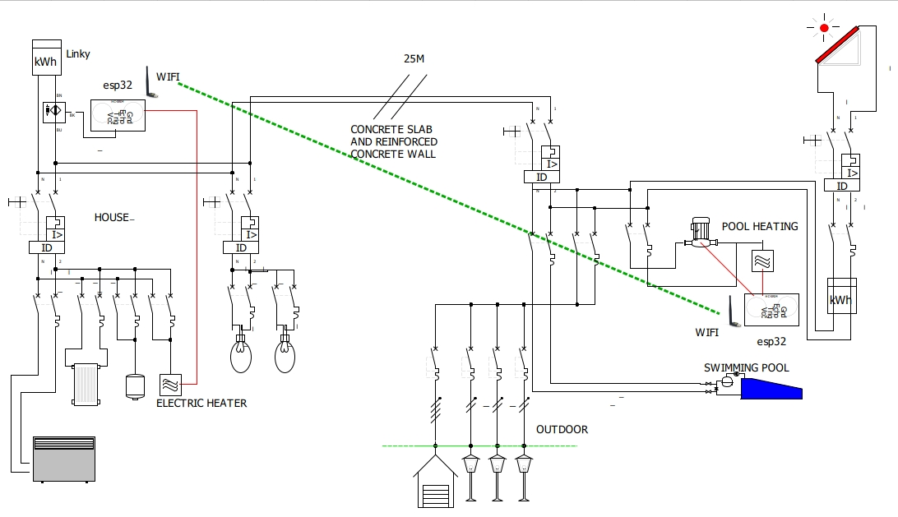
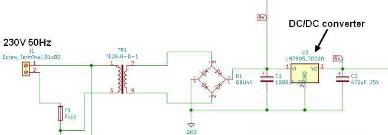
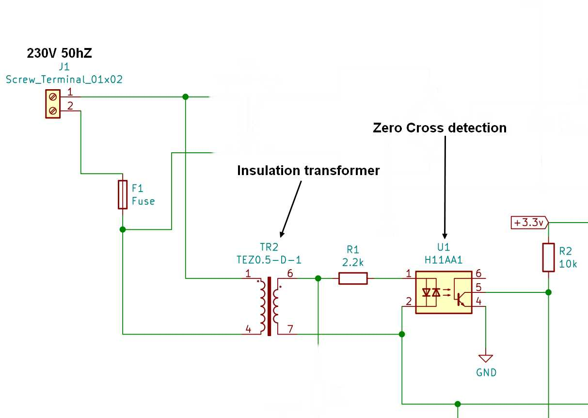
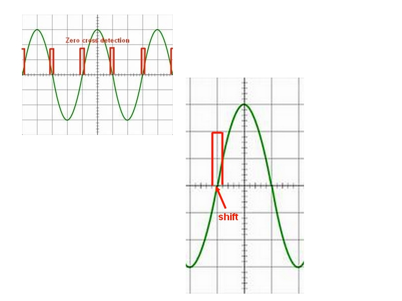
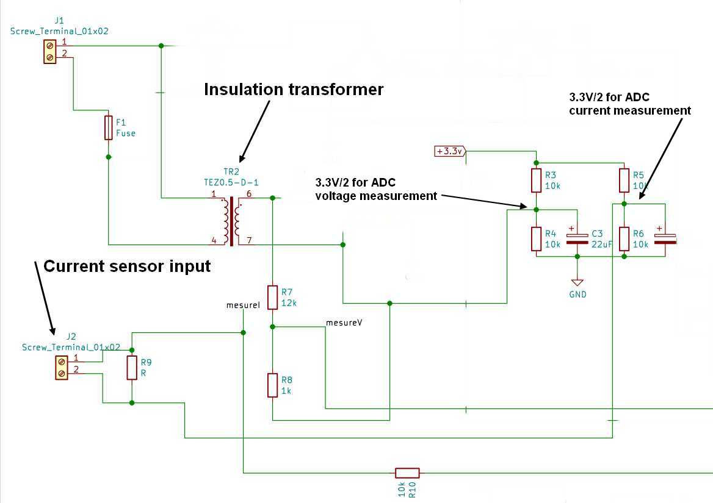
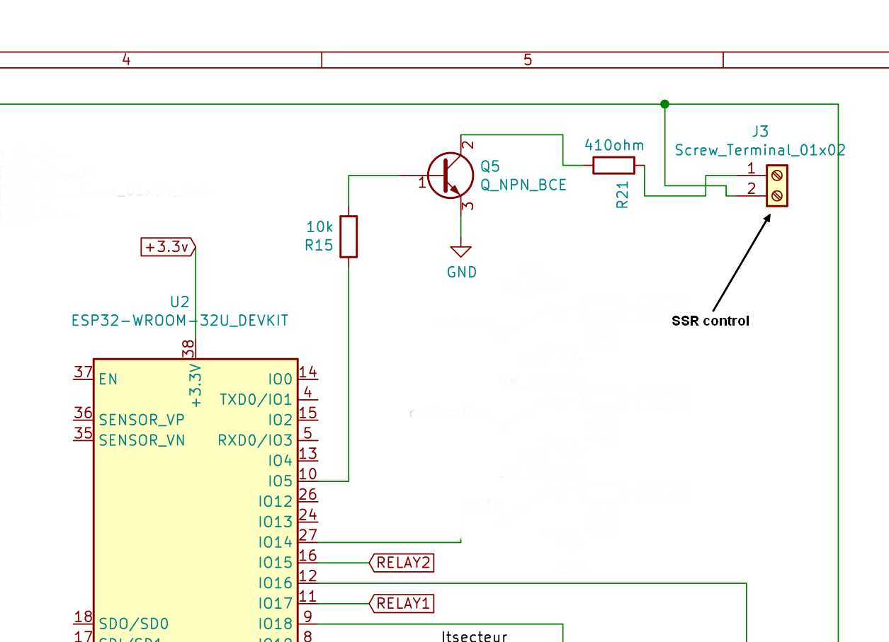
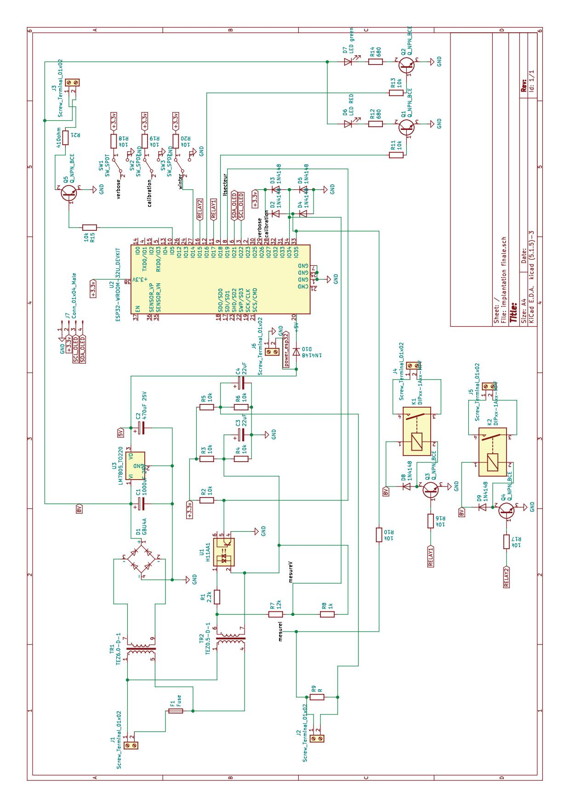
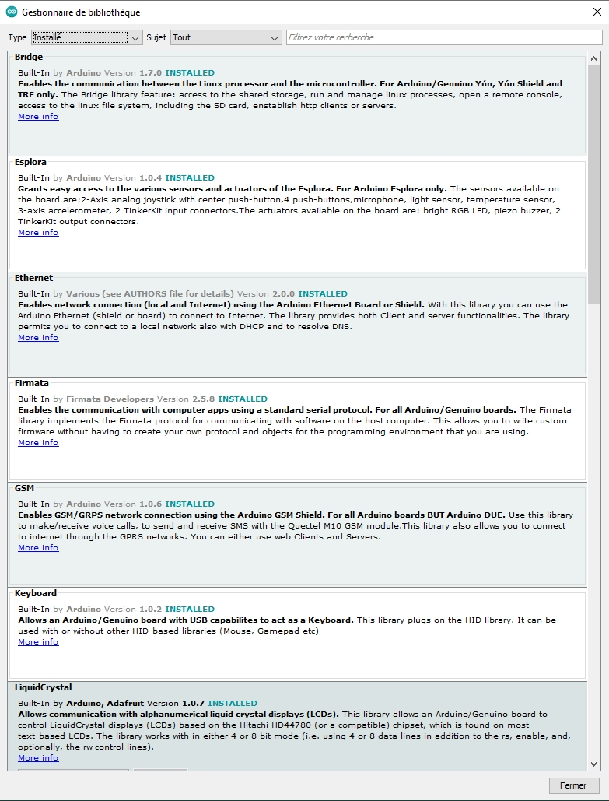
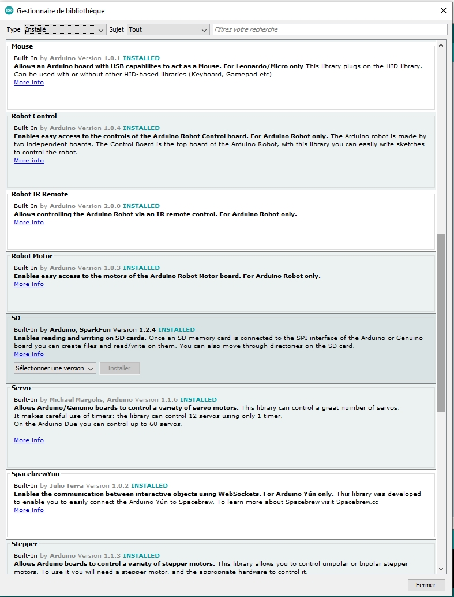
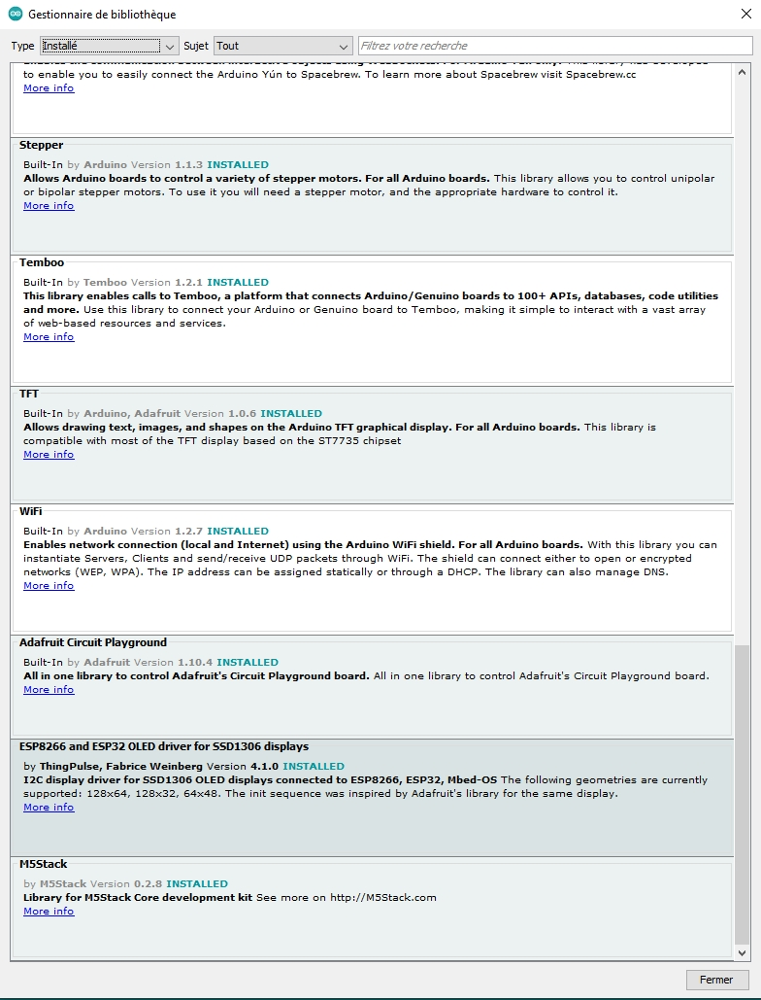

# Solar Panel Optimizer with WiFi Slave SSR

    The goal of this website is to explain why and how I created a solar panel optimizer with a WiFi slave SSR.
    First of all, I decided to install solar panels to offset the energy needed by the swimming pool pump.

    The pump is rated at 1.1 kW, so I installed 4 × 250 W solar panels on the roof of a firewood storage shed.

[solar panel website](https://www.oscaro-power.com/kit-solaire-autoconsommation/706-3835-kit-solaire-autoconsommation-le-petit-kit-meilleur-prix.html#/175-nombre_de_panneau_kit-4/768-type_de_fixation-fibrociment)


    Because of mains regulations, I realized that the excess energy must not be sent to the grid.

    This will be the case in winter (no swimming), and in spring or autumn, when the pool pump runs

    only 3 or 4 hours per day.

    It may also happen in summer, when the pump runs 6 or 7 hours per day.

    In winter, the excess energy could be used to heat my workshop in the basement.

    In the other seasons, a second small pump for a waterfall and a swimming pool heater could use

    this excess energy.

    Below is my home electric wiring.



    Many thanks to my colleagues Xavier, Nabil, Régis and Benjamin.

    Please note that this was my first hardware and software project since my Ph.D., forty years ago...


# Optimizer description

The issue was the existing electric wiring, so I decided to create a solar panel optimizer with a WiFi slave SSR. See my home electric wiring description above.

Many optimizers exist, both commercial ones and DIY projects. Commercial optimizers are quite expensive and not very efficient. After several weeks of reading websites and DIY optimizer descriptions, I decided to create my own project, and it was great fun!

The solar panel optimizer is based on an ESP32-DEVKITC-32U processor board, which is compatible with Arduino. The existing DIY projects are based on Arduino.

 [mk2pvrouter](https://mk2pvrouter.co.uk/index.html)

 [ptwatt](http://ptiwatt.kyna.eu/?post/2018/07/23/Fabriquer-un-power-router)

 [forum photovoltaique](http://forum-photovoltaique.fr/viewtopic.php?f=18&t=38146)


The ESP32 module embeds a 32-bit dual-core processor and a WiFi link.
One core is used for the power calculation and the other for the WiFi link.
The power calculation is mainly based on the ptiwatt router.


# Hardware description


A power supply provides +8 V and a regulated +5 V.



An H11A1 optocoupler detects the zero-crossing interrupt.



A small shift is compensated by software (dimthreshold). The falling edge is masked by software (first_it_zero_cross).



Voltage and current are measured using the ADC, with an offset of 3.3 V/2.



A command output drives the SSR.



The full schematic is available on GitHub.




The first version of the PCB was tested and needs some modifications. The updated version has not been tested.

Both versions of the Gerber files for manufacturing are available on GitHub.

PCB supplier: [jlcpcb](https://jlcpcb.com/)

BOM supplier: mainly AliExpress, and friends...


# Software description


    See the comments in the source code :-)

[github](https://github.com/jjdegaine/Wifi-Solar-panel-optimizer-)

There is one program for the server and one for the client.

The ESP32 processor needs a specific environment in the Arduino IDE.
See the link below to install the ESP32 environment.

[esp32 install](https://randomnerdtutorials.com/installing-the-esp32-board-in-arduino-ide-windows-instructions/)

I use an ESP32 Dev Module board: [ESP32 devkit](https://www.tme.eu/fr/details/esp32-devkitc-32u/outils-pour-transmission-de-donnees/espressif/)

Some other libraries are needed. I don't remember exactly which are mandatory and which were installed just for testing.







The software needs some calibration, depending on the components used.

    Measure the U and I ADC 0 V values using the software "testminmax_esp32" and modify the values.
    Connect the ESP board WITHOUT the mains to a PC with a USB cable.
    ADC values are available in a terminal (such as HyperTerminal at 115200 baud).

```c++
//

float ADC_V_0V = 467 ;
float ADC_I_0A = 467 ;
```


    Measure the zero-cross interrupt shift using the software "dim final" and modify the value.
    Connect an incandescent lamp to the SSR. At startup with DIM=0, the lamp shines. DIM then slowly increases, and at some point the lamp suddenly turns off. Note the DIM value shown on the LCD.
    By default, dimthreshold=30.

```c++
byte dimthreshold=30 ;	// dimthreshold: value added to dim to compensate for phase shift
```
    Download the final software (PowerRouter_v2.0 or client_v2.0).
    Measure the mains voltage and modify the Vcalibration value. Voltage and current can be displayed on the OLED using the switch SW2.

    ==> Vcalibration
```c++
float Vcalibration     = 0.90;   // to obtain the exact mains value
```

    Measure the mains current using a known power load and modify the Icalibration value.

    ==> Icalibration
```c++
float Icalibration     = 93;     // current in milliamperes
```
The board is ready to be used.

WiFi

    A UDP link is used to reduce data transfer: only the power value is transmitted, with an acknowledgment from the client.

    The power value is transmitted every 50 ms (byte send_UDP_max).

    A time-to-live is used to check WiFi activity and restart the WiFi link if needed.

    A small M5Stack module can be used as a remote display.

    WiFi parameters to be modified:

```c++
const char *ssid = "BB9ESERVER";   // for example, to be changed
const char *password = "BB9ESERVER";  // for example, to be changed
```
